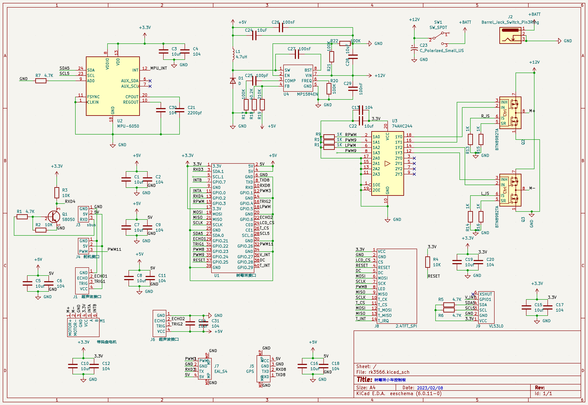

# linux 小车

## 电路图


### [MangoPi MQ QUAD 智能小车.](docs/Mangopi_MQ_Quad_Two_wheel.md)
### [LubancatzeroW 智能小车.](docs/LubanCat_Zero_W.md)

* 码农不易 尊重劳动
* 作者：大魔王与木头人
* 功能：基于Linux 的智能小车
* QQ：846863428
* TEL: 15220187476
* email: 846863428@qq.com
* 修改时间 ：2023-01-10

If you find my work useful and you want to encourage the development of more free resources, you can do it by donating…

觉得不错给鼓励一下

**拿人家代码不star不fork的都是耍流氓**

## network_manager 连接
```bash
sudo nmcli dev wifi connect OpenWrt_R619ac_2.4G password 67123236
```

## 安装依赖
```bash
sudo apt install -y g++ cmake git libyaml-cpp-dev
sudo apt install -y libgl1-mesa-dev libglu1-mesa-dev mesa-utils xorg swig
sudo apt install -y libgl1-mesa-glx libgl1-mesa-dri libglx-mesa0 libqt5opengl5-dev
sudo apt install ros-$ROS_DISTRO-rviz2
```

## 设置进本机通讯
对不需要联机场景，设置仅本行通讯
```bash
export ROS_LOCALHOST_ONLY=1
```
在 ~/.bashrc里面加入，每次打开终端都生效

## 安装TF tree发布工具
```bash
sudo apt install -y ros-$ROS_DISTRO-tf2-sensor-msgs
sudo apt install -y ros-$ROS_DISTRO-joint-state-publisher-gui ros-$ROS_DISTRO-robot-state-publisher
```

## 安装IMU显示插件
```bash
sudo apt install ros-$ROS_DISTRO-imu-tools
```

## 安装rqt
```bash
sudo apt install ros-$ROS_DISTRO-rqt
sudo apt install ros-$ROS_DISTRO-rqt-common-plugins
```

## 安装slam应用
```bash
sudo apt install ros-$ROS_DISTRO-cartographer ros-$ROS_DISTRO-cartographer-ros ros-$ROS_DISTRO-nav2-map-server
sudo apt install ros-$ROS_DISTRO-pcl*
```

## 编译ROS2
```bash
colcon build --packages-select chassis
colcon build --packages-select ydlidar
colcon build --packages-select fishbot_cartographer
colcon build --packages-select fishbot_description
```

## 编译ROS1
```bash
catkin_make -DCATKIN_WHITELIST_PACKAGES="chassis;ydlidar"
```

## 调试udev
```bash
udevadm info --query=all --name=sda # 查询sda的所有信息
udevadm info --query=path --name=sda # 查看sda的path
udevadm info --attribute-walk --name=/dev/nvme0n1  # 查看nvme0n1的所有父设备一直到sysfs的根节点
udevadm monitor --property   # 输出事件的属性
udevadm monitor --kernel --property --subsystem-match=usb    # 过滤监听符合条件的时间
udevadm info -q path -n /dev/sda # 查询/dev/sda设备的系统设备路径
udevadm info -q symlink -n /dev/sda # 查询/dev/sda设备的符号链接文件
udevadm info -q all -n /dev/sda # 查询/dev/sda设备的所有的值
udevadm info -a -p /sys/block/sda   # 查询系统设备的路径/sys/block/sda
```

```bash
KERNEL=="eth*", ATTR{address}=="00:52:8b:d5:04:48", NAME="lan"
```

## 启动底盘
```bash
sudo cp src/chassis/scripts/99-hardware-conf.rules /etc/udev/rules.d/
sudo udevadm control --reload-rules && sudo udevadm trigger
sudo src/chassis/scripts/luban_cat_ackerman_setup.sh # 解决权限问题
source install/setup.bash
ros2 launch chassis ackerman_chassis.launch.py # 单启动底盘
```

## slam建图
```bash
ros2 launch chassis slam_ldlidar_ld06.launch.py    # 阿克曼底盘，乐动ld06雷达
ros2 launch chassis slam_ldlidar.launch.py    # 阿克曼底盘，乐动ld19雷达
ros2 launch chassis slam_ydlidar.launch.py    # 两轮差速底盘，eai s4雷达
ros2 run nav2_map_server map_saver_cli -t map -f my_map # 地图保存
```

## 键盘控制
```bash
sudo apt install ros-$ROS_DISTRO-teleop-twist-keyboard
ros2 run teleop_twist_keyboard teleop_twist_keyboard
```

## 查看CPU频率
```bash
cat /sys/devices/system/cpu/cpu0/cpufreq/scaling_cur_freq
```
## 查看cpu温度
```bash
sudo apt install lm-sensors -y

sensors # 运行
```
or
```bash
cat /sys/devices/virtual/thermal/thermal_zone0/temp
```
开启风扇
```bash
echo 8 > /sys/class/thermal/cooling_device0/cur_state
```
Jetson nano开启风扇
```bash
sudo bash -c  'echo 120 > /sys/devices/pwm-fan/target_pwm' # 范围0-255
```

## 设置交换空间
完成下面的步骤，在 Ubuntu 20.04 上添加交换空间：

1. 首先，创建一个用作交换文件的文件：
```bash
sudo fallocate -l 2G /swapfile
```
如果fallocate工具在你的系统上不可用，或者你获得一个消息：fallocate failed: Operation not supported，使用下面的命令去创建交换文件：

```bash
sudo dd if=/dev/zero of=/swapfile bs=1024 count=2097152
```

2. 设置文件权限到600阻止常规用户读写这个文件：
```bash
sudo chmod 600 /swapfile
```

3. 在这个文件上创建一个 Linux 交换区：
```bash
sudo mkswap /swapfile
```
输出如下：
```
Setting up swapspace version 1, size = 2 GiB (2147479552 bytes)
no label, UUID=fde7d2c8-06ea-400a-9027-fd731d8ab4c8
```

4. 通过运行下面的命令，激活交换区：
```bash
sudo swapon /swapfile
```
想要持久化，打开/etc/fstab文件：
```bash
sudo nano /etc/fstab
```
并且粘贴下面的行：
```bash
/swapfile swap swap defaults 0 0
```
5. 使用swapon或者free命令来验证交换区是否已激活，像下面这样：
```bash
sudo swapon --show
NAME      TYPE      SIZE  USED PRIO
/swapfile file        2G    0B   -1
sudo free -h
total        used        free      shared  buff/cache   available
Mem:          981Mi        97Mi        68Mi       0.0Ki       814Mi       735Mi
Swap:         2.0Gi        10Mi       1.9Gi
```
6. 关闭交换空间
```bash
sudo swapoff /swapfile
```

## 添加开机自启动脚本(示例)
1. 建立frpc.service文件
```
sudo vim /lib/systemd/system/frpc.service
```

输入如下内容
```bash
[Unit]
Description=frpc
Requires=network.target
After=network.target

[Service]
Type=forking
ExecStart=/home/firefly/frp_0.48.0_linux_arm64/start_frpc.sh
Restart=always
RestartSec=60

[Install]
WantedBy=multi-user.target
```

2. 创建start_frpc.sh
```bash
sudo vim /home/firefly/frp_0.48.0_linux_arm64/start_frpc.sh
```
输入内容
```bash
#!/bin/bash

DIR="/home/leo/frp_0.51.3_linux_amd64"

processNum=`ps -ef | grep $DIR/frpc | grep -v grep | wc -l`
echo $processNum

if [ $processNum -eq 0 ]; then
	echo "frpc start"
	$DIR/frpc -c $DIR/frpc.ini &
else
	echo "frpc running"
fi
```

3. 添加可执行权限
```bash
sudo chmod +x /home/firefly/frp_0.48.0_linux_arm64/start_frpc.sh
```

4. 创建软链接
```bash
sudo ln -s /lib/systemd/system/frpc.service /etc/systemd/system/frpc.service
```

5. 使能自启动
```bash
sudo systemctl start frpc.service # 启动
sudo systemctl status frpc.service # 查看状态
sudo systemctl enable frpc.service # 开机自启动
```

## 小车自启动脚本
```bash
cp src/chassis/scripts/cat_ld06_start/luban_cat_ackerman_setup.sh /home/cat
cp src/chassis/scripts/cat_ld06_start/chassis.service /lib/systemd/system
sudo ln -s /lib/systemd/system/chassis.service /etc/systemd/system/chassis.service
sudo systemctl start chassis.service # 启动底盘
sudo systemctl stop chassis.service # 停止底盘
sudo systemctl status chassis.service # 查看状态
sudo systemctl enable chassis.service # 开机自启动
sudo systemctl disenable chassis.service # 关闭开机自启动
```