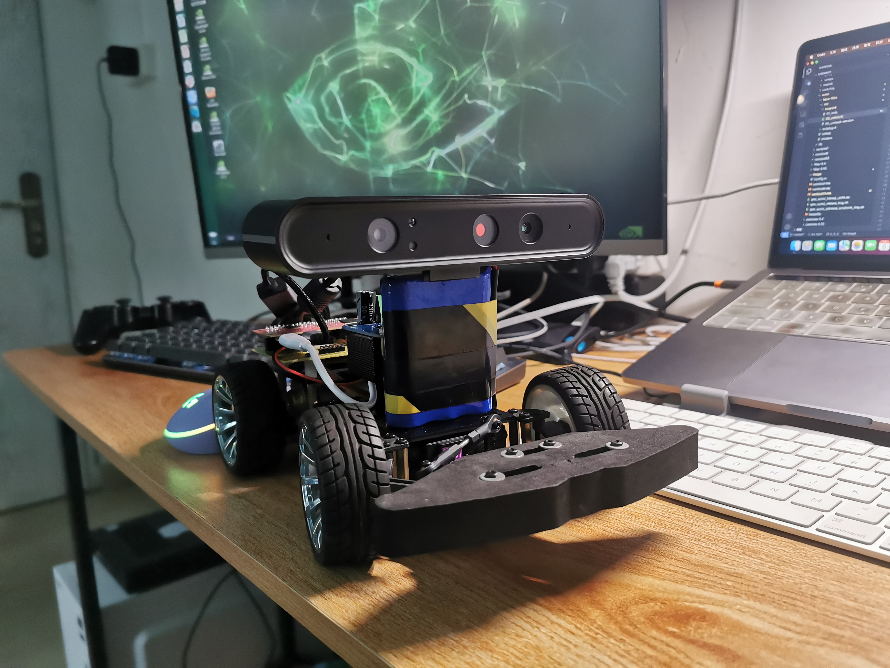

# 迅龙 OrangePi PC2 智能小车

## 状态
进行中



## 硬件连接
| 连接设备       | name    | PIN | PIN | name     | 连接设备       |
|---------------|---------|-----|-----|----------|---------------|
| NC            | 3.3v    | 1   | 2   | 5v       | NC            |
| MPU6050 SDA   | SDA     | 3   | 4   | 5v       | NC            |
| MPU6050 SCL   | SCL     | 5   | 6   | GND      | NC            |
| SR04 Echo     | PA6     | 7   | 8   | PC5      | NC            |
| NC            | GND     | 9   | 10  | PC6      | NC            |
| 遥控接收器SBUS  | UART2_RX| 11  | 12  | PD14     | BTS7960 LPWM  |
| NC            | UART2_TX| 13  | 14  | GND      | NC            |
| 舵机PWM        | PA3     | 15  | 16  | PC4      | BTS7960 EN    |
| NC            | 3.3v    | 17  | 18  | PC7      | BTS7960 RPWM  |
| SONY PS2 CMMD | MOSI    | 19  | 20  | GND      | NC            |
| SONY PS2 DAT  | MISO    | 21  | 22  | PA2      | MPU6050 INT   |
| SONY PS2 CLK  | SCLK    | 23  | 24  | CS0      | SONY PS2 ATT  |
| NC            | GND     | 25  | 26  | PA21     | NC            |
| NC            | TWI1-SDA| 27  | 28  | TWI1-SCK | NC            |
| SR04 Trig     | PA7     | 29  | 30  | GND      | NC            |
| 编码器A相      | PA8     | 31  | 32  | PG8      | NC            |
| 编码器B相      | PA9     | 33  | 34  | GND      | NC            |
| BTS7960 R_IS  | PA10    | 35  | 36  | PG9      | NC            |
| BTS7960 L_IS  | PD11    | 37  | 38  | UART1_TX | 调试串口tx      |
| NC            | GND     | 39  | 40  | UART1_RX | 调试串口rx      |


**注意:**

1. 在sbus接收机连接上，PC2和MQ PRO的串口是反的

2. PWM0 脚在调试串口上，需要配置其他串口作为调试,同时连接的IO PC4设置为输入

3. 需要装载pwm-gpio驱动，软件模拟一路pwm

## 设备树配置
开发需要更新设备树配置

[OrangePi Pc2 devicetree](https://github.com/MagicPrince666/openwrt/blob/master/target/linux/sunxi/files-5.10/arch/arm64/boot/dts/allwinner/sun50i-h5-orangepi-pc2.dts)

## 编译香橙派PC2
```
$ mkdir build
$ cd build
$ cmake -DCMAKE_TOOLCHAIN_FILE=cmake/build_for_orangepi_pc2.cmake ..
$ cmake -DCMAKE_TOOLCHAIN_FILE=cmake/build_for_orangepi_pc2.cmake -DCMAKE_BUILD_TYPE=Debug ..
```

## 已完成
1. 遥控接收机sbus解码
2. 陀螺仪数据获取
3. 电机正反转IO控制
4. 解决gpio 模拟pwm， 解决舵机角度控制和电机速度控制问题
5. 获取USB摄像头数据
6. rtsp 视频直播
7. 超声波传感器数据获取
8. 通过配置文件（json）适配硬件，与软件代码无关
9. 监控文件发生变化
10. 支持GPS定位模块数据获取
11. 更换带码盘电机
12. 支持USB手柄
13. IMU位姿解算

## TO DO
1. 电机支持PID控制
2. 图像识别算法引入
3. 支持udp控制

## 文件拷贝命令
设备端
```
$ mkdir /mnt/sdcard
$ mount /dev/mmcblk0p1 /mnt/sdcard/
```

PC端
```
$ scp build_dir/target-aarch64_cortex-a53_musl/linux-sunxi_cortexa53/linux-5.10.162/arch/arm64/boot/dts/allwinner/sun50i-h5-orangepi-pc2.dtb root@192.168.34.112:/mnt/sdcard/dtb
$ scp build_dir/target-aarch64_cortex-a53_musl/linux-sunxi_cortexa53/pwm-gpio-huangliquan/pwm-gpio.ko root@192.168.34.112:/root
```